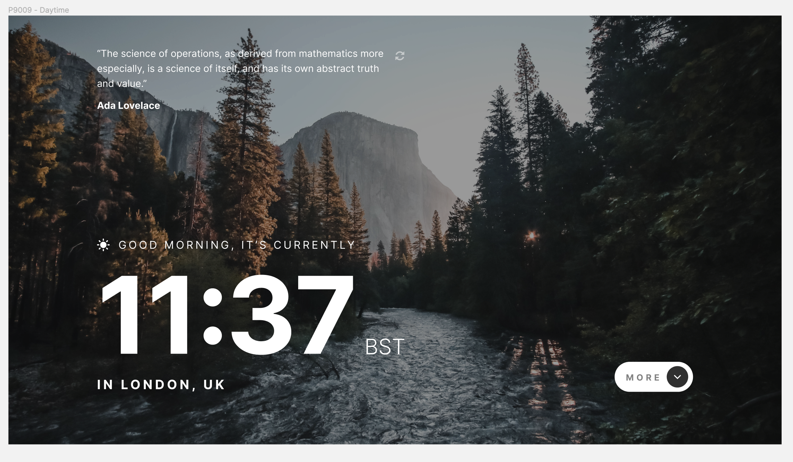
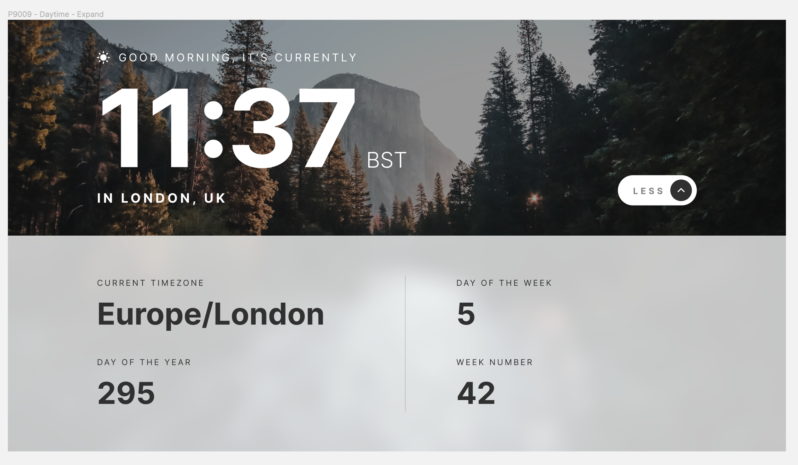
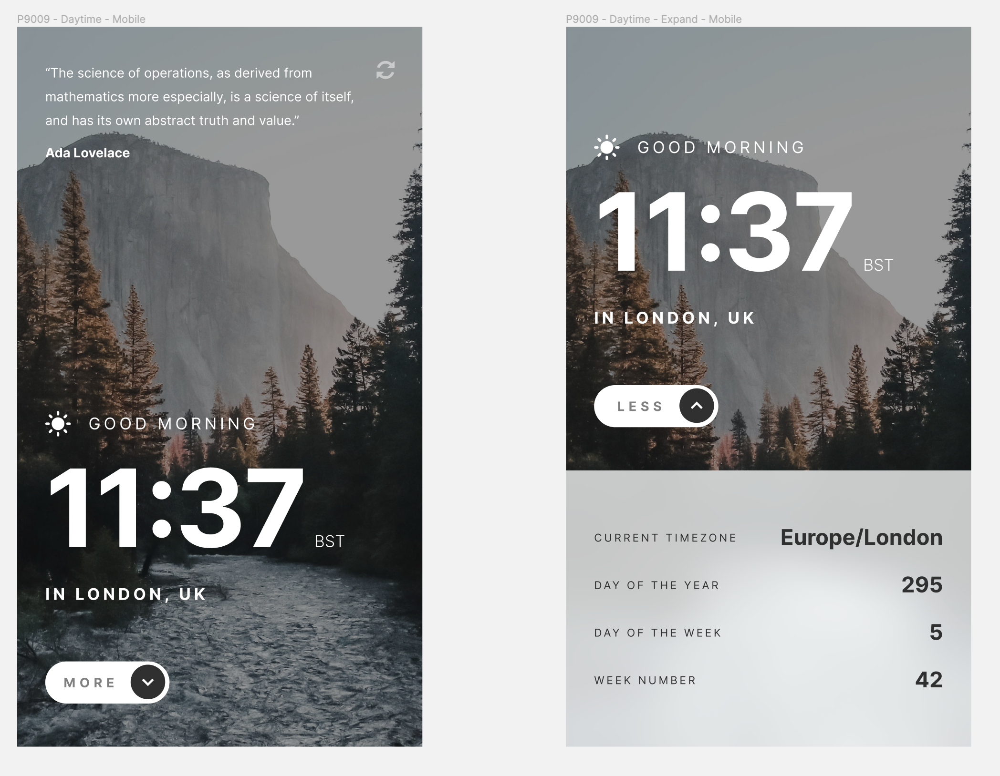
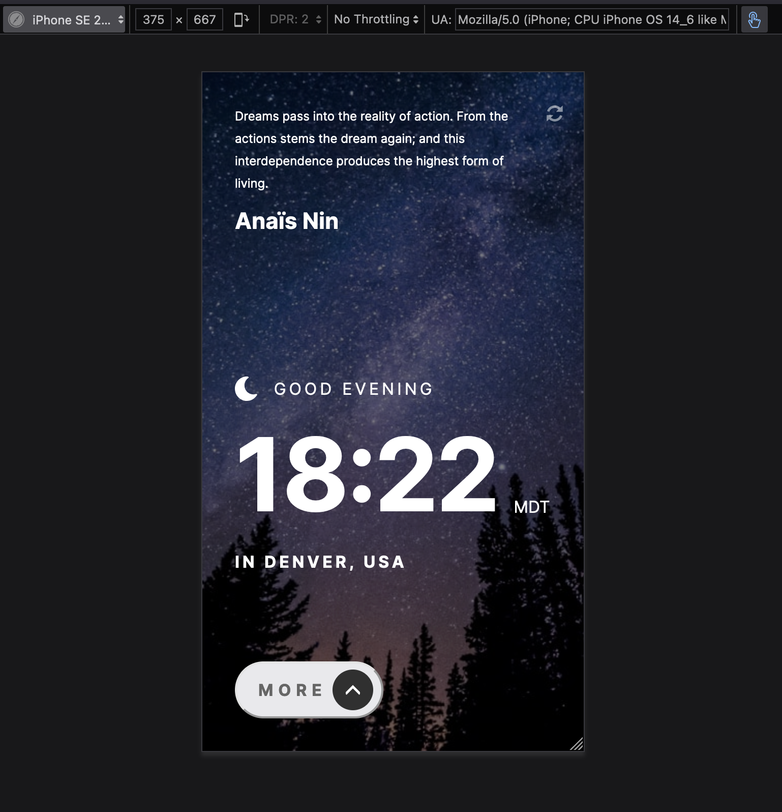
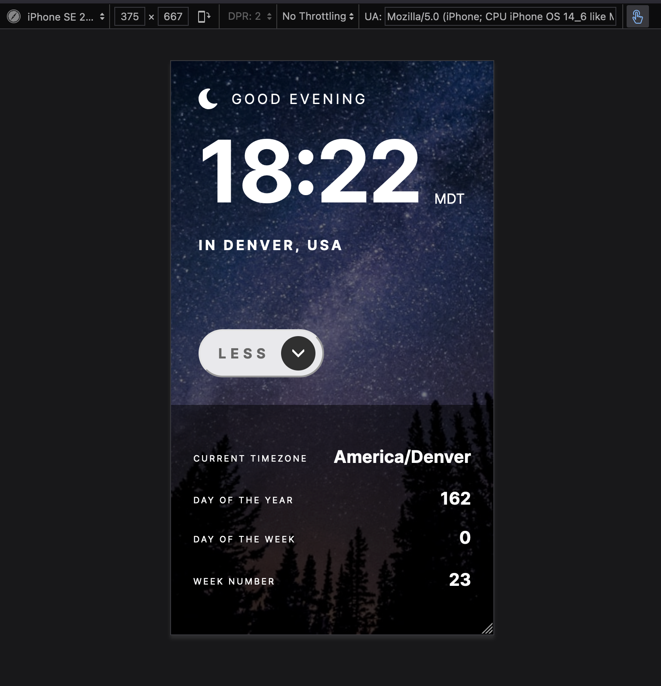
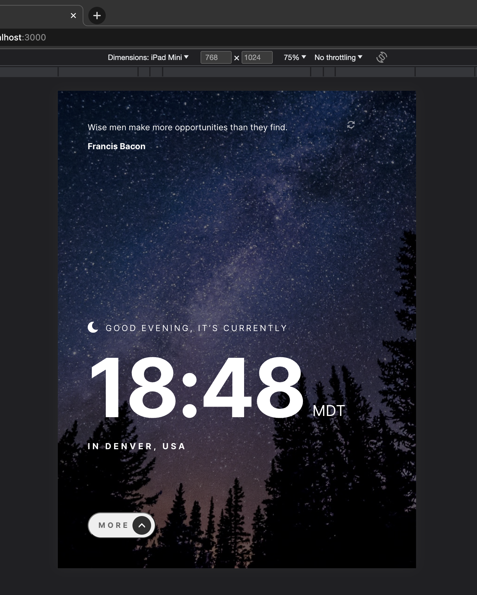
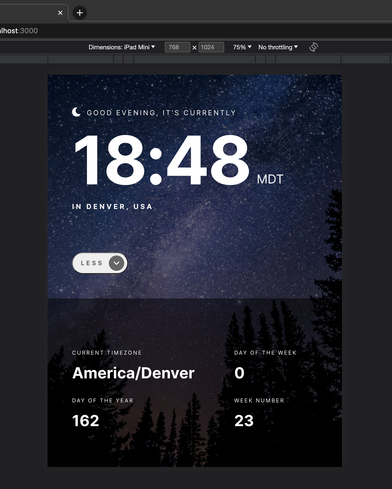

# Frontend Mentor - Clock App Solution

This is a solution to the [Clock app challenge on Frontend Mentor](https://www.frontendmentor.io/challenges/clock-app-LMFaxFwrM). Frontend Mentor challenges help you improve your coding skills by building realistic projects.

## Table of contents

- [Overview](#overview)
- [The challenge](#the-challenge)
- [Links](#links)
- [Built with](#built-with)
- [Screenshot](#screenshot)

## Overview

### The challenge

A clock app that tell the time live based on the user's current IP address.

Users should be able to:

- View the optimal layout for the interface depending on whether their device's screen size is mobile or tablet. In this example set up for Iphone SE and IPad Mini.

- See hover and focus states for all interactive elements on the page

### Links

- Live Site URL: [github page](https://nicorithner.github.io/fe-mentor-clock-app-solution/)

### Built with

- [React](https://reactjs.org/) - JS library
- [TypeScript](https://www.typescriptlang.org/) - TypeScript is JavaScript with syntax for types.
- [Styled Components](https://styled-components.com/) - For styles.
- [Quotable API](https://api.quotable.io) - A quotes api.
- [World Time API](http://worldtimeapi.org) - An API with time data based on IP address
- [React-Live-Clock](https://www.npmjs.com/package/react-live-clock) - A live clock package for React
- [Figma](https://www.figma.com/) - Figma, as design source

### Screenshots

#### Desktop View

  

  

  

  

#### Mobile View

  

  

  

#### Tablet View

  

  

